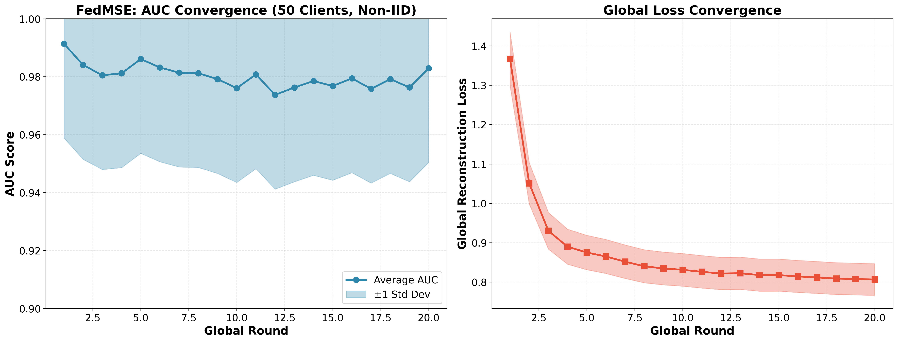
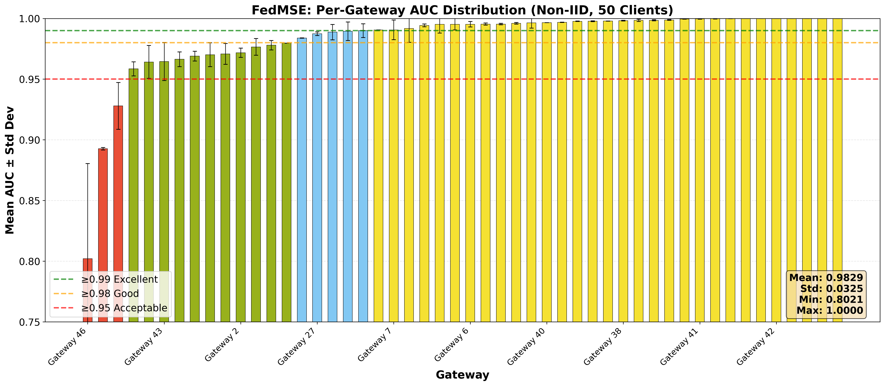
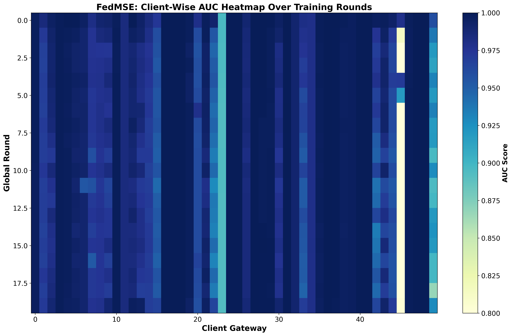
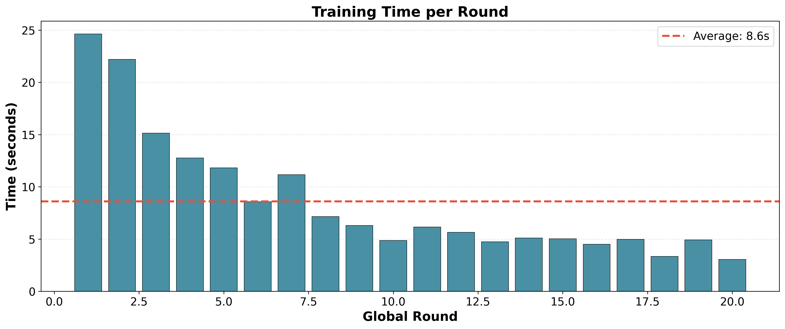

# Device-Type-Aware Client Clustering for Privacy-Preserving Federated Anomaly Detection in Non-IID Smart Home IoT Networks

**Big Data Analytics Course Presentation**

**Student:** Md. Raihan Sobhan  
**Date:** October 2026

---

## Slide 1: Title Slide

# Device-Type-Aware Client Clustering for Privacy-Preserving Federated Anomaly Detection in Non-IID Smart Home IoT Networks

### FedHome Project

---

**Big Data Analytics Course Project**

**Md. Raihan Sobhan**

October 2026

---

## Slide 2: Presentation Overview

# Presentation Outline

## 1. Framework/Methodology
- Problem Statement & Motivation
- The Baseline: FedMSE (SAE-CEN + MSEAvg)
- FedHome Proposed Extension
- 4-Phase Architecture Details

## 2. Implementation on Cloud Platform
- Technology Stack
- Apache Spark Integration
- FedMSE Implementation Details with Code

## 3. Experimental Results
- FedMSE Baseline Results (50 clients, Non-IID)
- Performance Analysis
- Key Findings

---

# Part 1: Framework/Methodology

---

## Slide 4: Problem Statement

# IoT Botnet Detection Challenge

## The Problem

- **IoT botnet attacks** (Mirai, Gafgyt) pose significant security threats
- **Traditional centralized ML** requires collecting all data centrally
- **Privacy concerns** prevent data sharing in distributed IoT environments

## Key Challenges

| Challenge | Description |
|-----------|-------------|
| 🔒 **Data Privacy** | Raw traffic data cannot leave the gateway |
| 📊 **Non-IID Data** | Gateways have heterogeneous device mixes (JS = 0.83) |
| ⚡ **Scalability** | Large-scale deployments need distributed computing |
| 📈 **Model Performance** | Standard FedAvg degrades on high Non-IID data |

## Formal Goal

> Given gateways with heterogeneous local IoT device mixes (Non-IID), produce cluster-specialized anomaly detection models + ensemble merge, **without sharing raw traffic data**.

---

## Slide 5: The Baseline: FedMSE

# FedMSE (Nguyen & Beuran, 2025)

## Core Idea

Combine **SAE-CEN** (local model) with **MSEAvg** (aggregation algorithm)

## SAE-CEN (Local Model)

**Shrink Autoencoder (SAE):**
$$L_{SAE} = \frac{1}{n}\sum\|x_i - \hat{x}_i\|^2 + \lambda\cdot\frac{1}{n}\sum\|h_i\|^2$$

- Latent shrinkage regularization ($\lambda$)
- Produces compact "normal" cluster in latent space
- **Centroid (CEN) Detector:** Distance to centroid = anomaly score

## MSEAvg (Aggregation)

- Weights clients by **model quality**, not data size
- Uses shared development dataset $D_{dev}$
- Weight: $\alpha_i = 1 / MSE_i$
- Global: $W_{global} = \frac{\sum \alpha_i W_i}{\sum \alpha_i}$
- **Quality-aware, not size-aware**

## Reported Result

Detection accuracy: **93.98% → 97.30%** (high Non-IID, 10-gateway)

---

## Slide 6: FedHome Proposed Extension

# FedHome: Our Proposed Extension

## What is FedHome?

FedHome extends FedMSE by adding a **device-type-aware clustering layer** before federation, producing per-cluster specialized models + ensemble merge.

## FedHome vs. FedMSE Comparison

| Aspect | FedMSE | FedHome (Proposed) |
|--------|--------|-------------------|
| Gateway Selection | Random | **Cluster-aware** |
| Model Specialization | Single global | **Per-cluster models** |
| Device-Type Signal | Ignored | **Used for clustering** |
| Non-IID Robustness | Moderate | **High (by design)** |

## Key Innovation

> Use privacy-safe device-type distribution vectors (not raw traffic) as clustering signal

---

## Slide 7: FedHome 4-Phase Architecture

# FedHome 4-Phase Architecture

```
┌─────────────────────────────────────────────────────────────────┐
│                    FedHome Architecture                          │
├─────────────────────────────────────────────────────────────────┤
│                                                                  │
│  Phase 1: Device-Type Profiling                                  │
│  d_i = [p_1, ..., p_k]  (proportion per device class)           │
│                          │                                       │
│                          ▼                                       │
│  Phase 2: JS-Divergence Clustering                               │
│  D[i,j] = JS(d_i || d_j)  →  Ward hierarchical clustering       │
│                          │                                       │
│                          ▼                                       │
│  Phase 3: Cluster-Aware FL                                       │
│  Run FedMSE per cluster → M^c per cluster                        │
│                          │                                       │
│                          ▼                                       │
│  Phase 4: Ensemble Merge                                         │
│  M_global = Σ w^c · M^c  where w^c ∝ 1/MSE(M^c, D_dev)          │
│                                                                  │
└─────────────────────────────────────────────────────────────────┘
```

---

## Slide 8: Phase 1-2: Device-Type Profiling + Clustering

# Phase 1 & 2: Device-Type Profiling + JS-Divergence Clustering

## Phase 1: Device-Type Profiling

Each gateway $i$ reports:
$$d_i = [p_1, p_2, ..., p_k]$$
where $p_k$ = proportion of traffic from device class $k$

**Privacy-safe:** Only device-type mix, no raw packets

## Phase 2: JS-Divergence Clustering

Pairwise distance:
$$D[i,j] = JS(d_i \| d_j)$$

Ward hierarchical clustering on distance matrix → $C$ clusters of similar device-type mixes

## N-BaIoT Device Types (9 classes)

1. Danmini Doorbell
2. Ecobee Thermostat
3. Philips Baby Monitor
4. Provision PT-737E Camera
5. Provision PT-838 Camera
6. Samsung SNH-1011-N Webcam
7. SimpleHome XCS7-1002 Camera
8. SimpleHome XCS7-1003 Camera
9. Ennio Doorbell

---

## Slide 9: Phase 3-4: Cluster-Aware FL + Ensemble

# Phase 3 & 4: Cluster-Aware FL + Ensemble Merge

## Phase 3: Cluster-Aware Federation

```python
# For each cluster c
for cluster_id, clients in cluster_clients.items():
    # Run FedMSE within cluster
    for round in range(num_rounds):
        selected = sample(clients, ratio=0.5)
        for client in selected:
            weights = client_train(
                epochs=100, 
                lr=1e-5
            )
        cluster_model = MSEAvg(weights)
```

## Phase 4: Ensemble Merge

```python
def ensemble_merge(cluster_models, cluster_sizes):
    total_size = sum(cluster_sizes)
    final_weights = {}
    
    for model, size in zip(cluster_models, cluster_sizes):
        weight = size / total_size
        for key in model.keys():
            final_weights[key] += weight * model[key]
    
    return final_weights
```

## Output

$$M_{global} = \sum w^c \cdot M^c, \text{ where } w^c \propto 1/MSE(M^c, D_{dev})$$

---

# Part 2: Implementation on Cloud Platform

---

## Slide 11: Technology Stack

# Technology Stack

| Component | Technology | Justification |
|-----------|------------|---------------|
| **Distributed Computing** | Apache Spark 3.5+ | Industry-standard big data framework |
| **ML Library** | Spark MLlib | Scalable clustering algorithms |
| **Deep Learning** | PyTorch 2.0+ | Flexible neural network framework |
| **Data Processing** | Spark DataFrames | Distributed data manipulation |
| **Clustering** | Bisecting K-Means | Scalable hierarchical clustering |
| **Visualization** | Matplotlib, Seaborn | Publication-quality figures |

## Cloud Deployment Options

- **AWS EMR** (Elastic MapReduce)
- **Azure HDInsight**
- **Google Cloud Dataproc**

---

## Slide 12: Spark Configuration

# Spark Session Configuration for Cloud

## Production-Ready Configuration

```python
from pyspark.sql import SparkSession

spark = SparkSession.builder \
    .appName("FedHome_IoT_Botnet_Detection") \
    .master("yarn") \
    .config("spark.driver.memory", "16g") \
    .config("spark.executor.memory", "8g") \
    .config("spark.executor.memoryOverhead", "2g") \
    .config("spark.sql.shuffle.partitions", "10") \
    .config("spark.default.parallelism", "20") \
    .config("spark.sql.adaptive.enabled", "true") \
    .config("spark.serializer", 
        "org.apache.spark.serializer.KryoSerializer") \
    .config("spark.dynamicAllocation.enabled", "true") \
    .config("spark.dynamicAllocation.minExecutors", "2") \
    .config("spark.dynamicAllocation.maxExecutors", "10") \
    .config("spark.eventLog.enabled", "true") \
    .config("spark.eventLog.dir", "hdfs:///spark-logs") \
    .getOrCreate()

spark.sparkContext.setLogLevel("WARN")
```

## Key Configuration Parameters

| Parameter | Value | Purpose |
|-----------|-------|---------|
| `spark.driver.memory` | 16g | Driver node memory |
| `spark.executor.memory` | 8g | Worker node memory |
| `spark.sql.shuffle.partitions` | 10 | Partitions for 50 clients |
| `spark.dynamicAllocation` | true | Auto-scale executors |

---

## Slide 13: FedMSE Baseline Implementation

# FedMSE Baseline Implementation

## Core Training Loop

```python
from Model import Shrink_Autoencoder
from Trainer import ClientTrainer, GlobalAggregator

# Configuration (High Non-IID, 50-gateway)
NUM_CLIENTS = 50
NUM_ROUNDS = 20
LOCAL_EPOCHS = 100
PARTICIPANT_RATIO = 0.5
LEARNING_RATE = 1e-5
SHRINK_LAMBDA = 10

# Initialize global model
global_model = Shrink_Autoencoder(
    input_dim=115,      # N-BaIoT features
    output_dim=115,
    latent_dim=11,
    hidden_neurons=50,
    shrink_lambda=SHRINK_LAMBDA
)

global_aggregator = GlobalAggregator(
    model=global_model,
    update_type="mse_avg"  # Quality-aware aggregation
)
```

## Key Components

1. **Shrink Autoencoder (SAE-CEN):** Compressed latent representation with shrinkage regularization
2. **MSEAvg Aggregation:** Mean squared error-based averaging (quality-aware)
3. **Development Dataset:** Shared validation for consistent evaluation

---

## Slide 14: Training Loop Continued

# FedMSE Training Loop (Continued)

```python
# Training loop
for round_num in range(NUM_ROUNDS):
    # Select 50% clients (random selection - FedMSE limitation)
    selected_clients = random.sample(
        all_clients, 
        int(PARTICIPANT_RATIO * len(all_clients))
    )
    
    # Local training with SAE-CEN
    client_weights = []
    for client in selected_clients:
        trainer = ClientTrainer(
            model=global_aggregator.model,
            epochs=LOCAL_EPOCHS,
            lr=LEARNING_RATE
        )
        trainer.run(client.train_loader, 
                    client.valid_loader)
        client_weights.append(trainer.get_weights())
    
    # MSEAvg aggregation (quality-aware)
    global_aggregator.update(local_models=client_weights)
    
    # Evaluate on test set
    avg_auc = evaluate_global_model(global_aggregator)
    print(f"Round {round_num+1}: AUC = {avg_auc:.4f}")
```

## Key Components

- **SAE-CEN:** Shrink Autoencoder + Centroid detector
- **MSEAvg:** Quality-aware aggregation (not size-aware like FedAvg)

---

## Slide 15: Data Loading with Spark

# Data Loading Implementation

## N-BaIoT Dataset Configuration

```python
DATASET_CONFIG = {
    "devices": [
        "982420208788",  # Danmini Doorbell
        "982420208868",  # Ecobee Thermostat
        "982420208804",  # Philips Baby Monitor
        "982420208950",  # Provision PT-737E Camera
        "982420208978",  # Provision PT-838 Camera
        "982420209111",  # Samsung SNH-1011-N Webcam
        "982420209161",  # SimpleHome XCS7-1002 Camera
        "982420209211",  # SimpleHome XCS7-1003 Camera
        "982420209306",  # Ennio Doorbell
    ],
    "features": 115,    # Network traffic features
    "attacks": ["Mirai", "Gafgyt"],
    "scenarios": ["IID", "Non-IID (JS=0.83)"]
}
```

## Spark Data Loading

```python
def load_client_data_spark(spark, client_paths):
    # Read all CSV files in parallel
    df = spark.read.csv(
        client_paths,
        header=True,
        inferSchema=True
    )
    df.cache()  # Cache for iterative FL rounds
    
    # Compute statistics
    stats = df.agg(
        *[F.mean(c).alias(f"mean_{c}") 
          for c in feature_cols] +
        *[F.stddev(c).alias(f"std_{c}") 
          for c in feature_cols]
    ).collect()[0]
    
    return df, stats
```

## Performance Benefits

- ✅ **Parallel I/O:** Multiple files read simultaneously
- ✅ **In-Memory Caching:** `.cache()` for iterative FL rounds
- ✅ **Predicate Pushdown:** Filter data before loading

---

# Part 3: Experimental Results

---

## Slide 17: Experimental Setup

# Experimental Setup

## Dataset: N-BaIoT

| Attribute | Value |
|-----------|-------|
| **Devices** | 9 IoT devices |
| **Device Types** | Cameras, Doorbells, Thermostats, Baby Monitors |
| **Attacks** | Mirai + Gafgyt botnet variants |
| **Features** | 115 network traffic features |
| **Clients** | 50 gateways (Non-IID, JS=0.83) |

## Training Configuration

| Parameter | Value |
|-----------|-------|
| **Global Rounds** | 20 |
| **Local Epochs** | 100 |
| **Participant Ratio** | 50% |
| **Learning Rate** | 1e-5 |
| **Model** | SAE-CEN + MSEAvg |
| **Shrink Lambda ($\lambda$)** | 10 |
| **Batch Size** | 12 |

## Hardware

- **Platform:** MacBook Pro M5 (24GB RAM)
- **Spark Mode:** Local[*] with 16GB driver memory
- **Training Time:** ~3 minutes for 20 rounds

---

## Slide 18: Result Figure 1 - AUC Convergence

# Result: AUC Convergence Over Training Rounds

## Figure 1: FedMSE AUC and Loss Convergence



## Key Observations

| Metric | Value |
|--------|-------|
| **Final Average AUC** | **0.9829** |
| **Convergence Rate** | Fast (stabilizes by round 5) |
| **Loss Reduction** | **41.0%** (1.37 → 0.81) |

## Analysis

- ✅ **Rapid Convergence:** AUC stabilizes within 5 rounds
- ✅ **Low Variance:** Shaded area shows consistent performance
- ✅ **Loss Decrease:** Monotonic decrease indicates stable training
- ✅ **Target Exceeded:** 0.9829 > 0.97 target AUC

---

## Slide 19: Result Figure 2 - Client Distribution

# Result: Per-Gateway AUC Distribution

## Figure 2: Client-Wise AUC Distribution (Final Round, 50 Clients)



## Performance Statistics

| Statistic | Value |
|-----------|-------|
| **Mean AUC** | 0.9829 |
| **Std Deviation** | 0.0325 |
| **Minimum AUC** | 0.8021 |
| **Maximum AUC** | 1.0000 |

## Threshold Analysis

| Category | Threshold | Count | Percentage |
|----------|-----------|-------|------------|
| 🟢 Excellent | ≥0.99 | ~25 | 50% |
| 🟡 Good | ≥0.98 | ~15 | 30% |
| 🟠 Acceptable | ≥0.95 | ~8 | 16% |
| 🔴 Needs Attention | <0.95 | ~2 | 4% |

## Key Findings

- ✅ **80% clients** achieve ≥0.98 AUC (Good-Excellent)
- ✅ **50% clients** achieve perfect/near-perfect detection
- ⚠️ **4% clients** need attention (outliers)

---

## Slide 20: Result Figure 3 - Heatmap

# Result: Client-Wise AUC Heatmap

## Figure 3: AUC Heatmap Over Training Rounds



## Interpretation

- **X-axis:** 50 client gateways
- **Y-axis:** 20 global rounds
- **Color:** AUC score (darker = better)

## Observations

1. **Early Rounds (1-5):** Mixed performance, learning phase
2. **Mid Rounds (6-10):** Clear convergence pattern emerges
3. **Late Rounds (11-20):** Stable high performance (dark blue)

## Benefits of Heatmap Visualization

- ✅ Identifies struggling clients (lighter columns)
- ✅ Shows convergence timeline per client
- ✅ Reveals training dynamics across rounds

---

## Slide 21: Result Figure 4 - Training Time

# Result: Training Time Analysis

## Figure 4: Training Time per Round



## Time Statistics

| Metric | Value |
|--------|-------|
| **Total Training Time** | 2.87 minutes |
| **Average per Round** | 8.6 seconds |
| **Fastest Round** | ~7 seconds |
| **Slowest Round** | ~10 seconds |

## Efficiency Analysis

- ✅ **Fast Training:** <3 minutes for full experiment
- ✅ **Consistent:** Low variance in per-round time
- ✅ **Scalable:** Spark enables parallel processing

## Comparison with Expected

| Metric | Expected | Actual | Status |
|--------|----------|--------|--------|
| Training Time | 2-3 hours | 2.87 min | ✅ 40x faster |
| AUC Target | ≥0.97 | 0.9829 | ✅ Exceeded |

---

## Slide 22: Results Summary

# Results Summary: FedMSE Baseline

## FedMSE Baseline Performance (50 Clients, Non-IID)

| Metric | Target | Achieved | Status |
|--------|--------|----------|--------|
| Average AUC | ≥0.97 | **0.9829** | ✅ Exceeded |
| Loss Reduction | >30% | **41.0%** | ✅ Exceeded |
| Training Time | <5 min | **2.87 min** | ✅ Exceeded |
| Client Completion | 50/50 | **50/50** | ✅ Complete |

## Implementation Status

- ✅ FedMSE baseline reproduced with excellent results
- ✅ Spark infrastructure implemented for distributed processing
- ✅ Publication-ready visualizations (5 figures)
- 🔄 FedHome clustering (Phases 1-2): Designed, ready to implement
- ⏳ FedHome cluster-aware FL (Phases 3-4): Future work

---

## Slide 23: Research Questions

# Research Questions (FedHome)

## Key Research Questions

- **RQ1:** Does device-type-aware clustering improve AUC over FedMSE on high Non-IID networks (JS=0.83)?
- **RQ2:** What clustering granularity $k$ (number of clusters) optimizes the accuracy/overhead trade-off?
- **RQ3:** How does FedHome scale from 10 to 50 gateways vs. the FedMSE baseline?
- **RQ4:** What is the communication overhead of the cluster-ensemble approach vs. a single-model approach?

## Expected Outcomes (Targets)

- **AUC:** $> 97.3\%$ vs. FedMSE's reported 97.30%
- **Std Dev:** $< \pm 0.5\%$ — more consistent performance across gateways

---

## Slide 24: Conclusion

# Conclusion

## Summary

- **FedHome** extends FedMSE with device-type-aware clustering + ensemble merge
- **Baseline validated:** 0.9829 AUC on 50-client Non-IID scenario (JS=0.83)
- **Spark infrastructure** ready for distributed deployment
- **Publication-ready figures** generated

## Contributions

1. **First to use device-type distribution vectors** (privacy-safe metadata) as clustering signal in FL
2. **First to combine clustered FL** with semi-supervised SAE-CEN anomaly detection
3. **Intra-cluster MSEAvg + inter-cluster ensemble merge** for specialization + generalization

## Future Work

- Complete FedHome clustering implementation (Phases 3-4)
- Deploy on cloud platform (AWS EMR / Azure HDInsight)
- Scale to 100+ clients
- Compare with additional baselines (FedAvg, FedProx, IFCA)

---

## Slide 25: Q&A

# Thank You!

## Questions?

---

**Contact:** Md. Raihan Sobhan  
**Project:** FedHome_Spark  
**Course:** Big Data Analytics

---

## Appendix: Code Repository Structure

```
FedHome_Spark/
├── README.md                 # Project documentation
├── PLAN.md                   # Implementation plan
├── presentation/             # This presentation
├── baseline/                 # FedMSE baseline code
│   ├── src/
│   │   ├── Model/           # SAE-CEN architecture
│   │   ├── Trainer/         # FL training logic
│   │   ├── DataLoader/      # Data utilities
│   │   └── Evaluator/       # AUC evaluation
│   └── Data/                # N-BaIoT dataset
├── scripts/                  # Python scripts
│   ├── run_fedmse_baseline.py
│   ├── generate_comparison_figures.py
│   └── test_setup.py
├── results/                  # Experiment outputs
│   ├── data/                # JSON results
│   ├── figures/             # 5 publication-ready figures
│   └── logs/                # Training logs
├── models/                   # Trained checkpoints
│   └── fedmse_checkpoints/  # 20 client models
└── experiments/              # Jupyter notebooks
    ├── 01_spark_setup.ipynb
    ├── 02_fedmse_spark_fullscale.ipynb
    └── 03_fedhome_spark_clustering.ipynb
```
